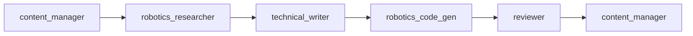
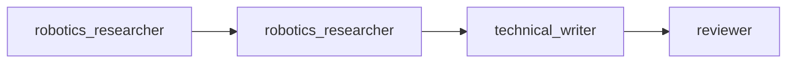
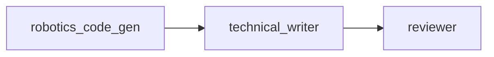

# Sub-Agent Skills Documentation

This document describes the specialized sub-agents available for the "Physical AI & Humanoid Robotics" book project and how to use them effectively.

## Available Sub-Agents

### 1. Technical Writer (`technical_writer`)

**Purpose**: Write clear, engaging, pedagogically sound technical content.

**Skills**:
- Explaining complex robotics and AI concepts
- Writing for technical learners (students, developers, engineers)
- Creating structured tutorials and guides
- Maintaining consistent tone and terminology
- Progressive complexity building

**When to Use**:
- Writing chapter introductions and summaries
- Explaining theoretical concepts
- Creating learning objectives
- Writing hands-on exercises
- Crafting key takeaways

**Input Requirements**:
- Chapter/section outline
- Learning objectives
- Research materials (from robotics_researcher)
- Target audience level

**Output**:
- Well-structured markdown content
- Clear explanations with examples
- Formatted with headings, lists, code blocks
- Includes learning checkpoints

**Example Usage**:
```
Task: Write Chapter 2, Section 2.1 (ROS 2 Architecture)
Input: 
- Outline: DDS middleware, node graph, QoS policies
- Learning objectives: Understand ROS 2 architecture layers
- Research: Latest ROS 2 Humble documentation
Output: Complete section with intro, concepts, examples, summary
```

---

### 2. Robotics Researcher (`robotics_researcher`)

**Purpose**: Find, synthesize, and provide the latest accurate information on robotics and AI.

**Skills**:
- Searching authoritative sources (docs, papers, industry blogs)
- Synthesizing complex information
- Comparing technologies and approaches
- Finding production-quality code examples
- Identifying best practices and common pitfalls

**When to Use**:
- Need latest information on a technology
- Comparing different frameworks or approaches
- Finding official documentation and examples
- Understanding state-of-the-art vs practical reality
- Researching real-world applications

**Input Requirements**:
- Research topic or question
- Specific focus areas
- Version requirements (e.g., ROS 2 Humble)

**Output**:
- Summary of key concepts
- Key findings with bullet points
- Technical details and implementation guidance
- Code example links
- Numbered source list with URLs

**Example Usage**:
```
Task: Research latest ROS 2 navigation stack features
Input: Focus on Nav2, humanoid robot applications, ROS 2 Humble
Output: 
- Summary of Nav2 capabilities
- Key findings (behavior trees, plugin architecture)
- Technical details (planning algorithms, controllers)
- Code examples and GitHub links
- Sources with dates
```

---

### 3. Robotics Code Generator (`robotics_code_gen`)

**Purpose**: Create high-quality, production-ready code examples for robotics concepts.

**Skills**:
- Writing production-quality Python and C++ code
- Following ROS 2 conventions and style guides
- Creating educational code with detailed comments
- Ensuring code is runnable and tested
- Providing setup and usage instructions

**When to Use**:
- Creating ROS 2 node examples
- Building simulation files (Gazebo, Isaac)
- Writing AI integration code
- Generating test code
- Creating complete working examples

**Input Requirements**:
- Specific concept to demonstrate
- Target framework/platform
- Complexity level
- Any specific requirements (e.g., must use actions)

**Output**:
- Complete, commented code files
- README with setup instructions
- Usage examples and expected output
- Key concepts explained
- Common modifications suggested

**Example Usage**:
```
Task: Create ROS 2 action server example for humanoid joint control
Input:
- Framework: ROS 2 Humble, Python
- Concept: Action servers for long-running tasks
- Use case: Joint trajectory following
Output:
- Complete Python node with action server
- Detailed comments and docstrings
- README with installation and run instructions
- Example action goal command
- Performance notes
```

---

### 4. Content Manager (`content_manager`)

**Purpose**: Organize, structure, and manage the book's content creation workflow.

**Skills**:
- Coordinating between sub-agents
- Tracking progress and dependencies
- Ensuring quality and consistency
- Managing content structure
- Identifying gaps and blockers

**When to Use**:
- Planning chapter creation workflow
- Tracking overall book progress
- Coordinating multi-agent tasks
- Ensuring quality standards
- Managing dependencies between sections

**Input Requirements**:
- Book outline and structure
- Current progress status
- Quality requirements

**Output**:
- Progress reports
- Task assignments for other agents
- Quality checklists
- Coordination workflows
- Status updates

**Example Usage**:
```
Task: Coordinate creation of Chapter 2, Section 2.2
Output:
- Step 1: Assign research to robotics_researcher
- Step 2: Assign writing to technical_writer
- Step 3: Assign code to robotics_code_gen
- Step 4: Assign review to reviewer
- Step 5: Integrate and update progress
```

---

### 5. Existing Agents (From Original Project)

#### Writer (`writer`)
- General book writing for "Agentic AI World"
- Can be adapted for general content

#### Researcher (`researcher`)
- General AI research
- Uses Context7 for documentation
- Can supplement robotics_researcher

#### Code Generator (`code_generator`)
- General code generation
- Can supplement robotics_code_gen

#### Outliner (`outliner`)
- Creates book outlines and structure
- Useful for planning new chapters

#### Reviewer (`reviewer`)
- Reviews content for quality and accuracy
- Technical and editorial review

---

## Multi-Agent Workflows

### Workflow 1: Creating a New Chapter Section



**Steps**:
1. **content_manager**: Plan section, define requirements
2. **robotics_researcher**: Gather information and best practices
3. **technical_writer**: Write explanatory content
4. **robotics_code_gen**: Create code examples
5. **reviewer**: Check quality and accuracy
6. **content_manager**: Integrate and track progress

---

### Workflow 2: Research-Heavy Topic



**Steps**:
1. **robotics_researcher**: Initial broad research
2. **robotics_researcher**: Deep dive on specific aspects
3. **technical_writer**: Synthesize into readable content
4. **reviewer**: Verify accuracy

---

### Workflow 3: Code-Centric Section



**Steps**:
1. **robotics_code_gen**: Create comprehensive code examples
2. **technical_writer**: Write explanatory text around code
3. **reviewer**: Test code and verify explanations

---

## Best Practices

### Agent Selection
- Use **robotics_researcher** for latest information
- Use **technical_writer** for explanations and tutorials
- Use **robotics_code_gen** for all code examples
- Use **content_manager** for coordination and tracking

### Task Clarity
- Provide clear, specific tasks
- Include all necessary context
- Specify deliverable format
- Set quality expectations

### Iteration
- Review agent output before next step
- Provide feedback for improvements
- Iterate until quality standards met

### Documentation
- Track all agent interactions
- Document decisions and rationale
- Maintain progress logs

---

## Quick Reference

| Need | Agent | Example Task |
|------|-------|--------------|
| Latest tech info | robotics_researcher | "Research ROS 2 Humble navigation features" |
| Explain concept | technical_writer | "Write section on DDS middleware" |
| Code example | robotics_code_gen | "Create publisher/subscriber example" |
| Coordinate work | content_manager | "Plan Chapter 3 creation workflow" |
| Review quality | reviewer | "Review Chapter 2 for accuracy" |
| Create outline | outliner | "Outline Chapter 4 sections" |

---

## Integration with Claude

To use these sub-agents with Claude Code:

1. **Reference the agent**: `@sub_agents/technical_writer/prompt.md`
2. **Provide context**: Include relevant context.md file
3. **Give clear task**: Specify exactly what you need
4. **Review output**: Check quality before proceeding

**Example**:
```
@sub_agents/robotics_code_gen/prompt.md
@sub_agents/robotics_code_gen/context.md

Task: Create a ROS 2 Python node that subscribes to camera images 
and publishes detected objects using YOLO.

Requirements:
- ROS 2 Humble
- Use sensor_msgs/Image for input
- Use vision_msgs/Detection2DArray for output
- Include error handling
- Add detailed comments
```

---

## Future Enhancements

Potential new sub-agents:
- **Diagram Generator**: Create mermaid diagrams and visualizations
- **Exercise Creator**: Generate hands-on exercises and solutions
- **Quiz Generator**: Create assessment questions
- **Video Script Writer**: Write scripts for video tutorials
- **API Documentation Generator**: Generate API reference docs
