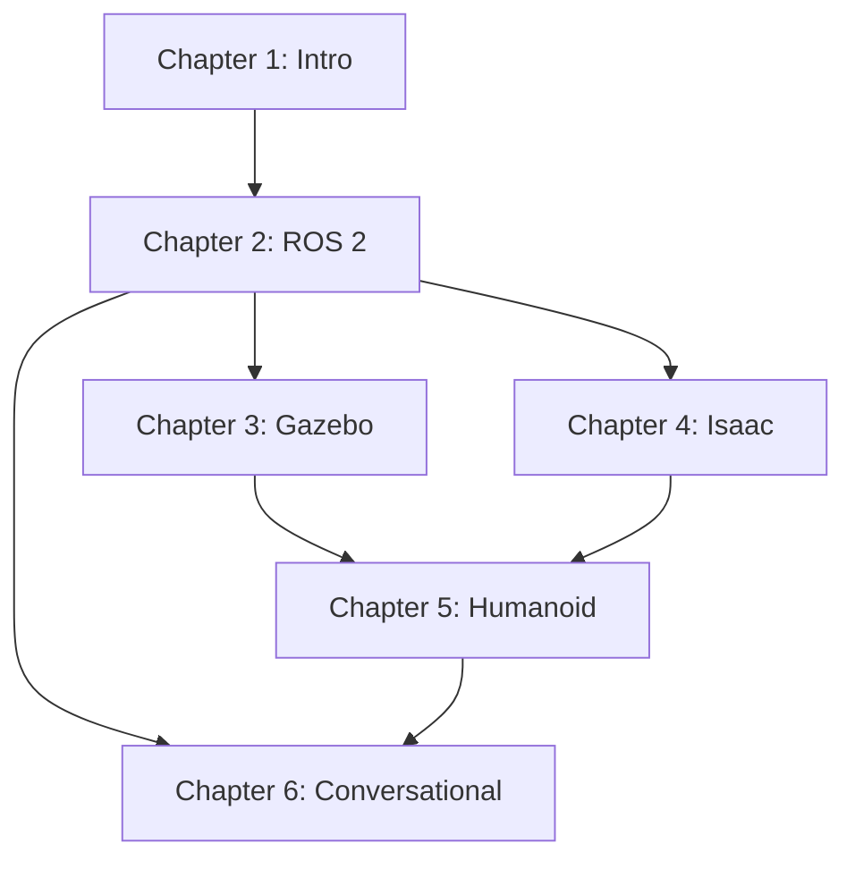

# Context for Content Manager Agent

## Content Management Scope

The Content Manager oversees the entire book creation process for "Physical AI & Humanoid Robotics," coordinating between specialized agents and ensuring quality, consistency, and completeness.

## Book Metadata

**Title**: Physical AI & Humanoid Robotics: A Comprehensive Guide
**Target Audience**: Students, developers, robotics engineers
**Estimated Length**: 300-400 pages
**Timeline**: 13 weeks for initial content creation
**Format**: Docusaurus-based interactive book with RAG integration

## Chapter Breakdown with Learning Objectives

### Chapter 1: Introduction to Physical AI (Weeks 1-2)

**Learning Objectives**:
- Understand the difference between digital AI and Physical AI
- Identify key components of embodied intelligence
- Recognize major humanoid robot platforms
- Understand sensor systems used in robotics

**Sections**:
1. **1.1 Foundations of Physical AI**
   - Definition and scope
   - Historical context
   - Current state of the art
   
2. **1.2 From Digital to Embodied Intelligence**
   - Limitations of digital-only AI
   - Physical world constraints
   - Sim-to-real gap
   
3. **1.3 Humanoid Robotics Landscape**
   - Major platforms (Atlas, Optimus, Digit, etc.)
   - Commercial vs research robots
   - Future trends
   
4. **1.4 Sensor Systems Overview**
   - LIDAR technology
   - RGB-D cameras
   - IMUs and force/torque sensors
   - Sensor fusion basics

**Estimated Pages**: 40-50
**Code Examples**: 3-5 sensor integration examples

---

### Chapter 2: ROS 2 Fundamentals (Weeks 3-5)

**Learning Objectives**:
- Set up ROS 2 development environment
- Create publishers, subscribers, services, and actions
- Build and manage ROS 2 packages
- Write launch files and manage parameters

**Sections**:
1. **2.1 ROS 2 Architecture**
   - DDS middleware
   - Node graph concept
   - QoS policies
   
2. **2.2 Nodes and Communication**
   - Publishers and subscribers
   - Services and clients
   - Actions for long-running tasks
   
3. **2.3 Building ROS 2 Packages**
   - Package structure
   - CMakeLists.txt and package.xml
   - Python vs C++ packages
   
4. **2.4 Launch Files and Parameters**
   - Python launch files
   - XML launch files
   - Parameter management
   - Namespaces and remapping

**Estimated Pages**: 60-70
**Code Examples**: 15-20 ROS 2 examples

---

### Chapter 3: Robot Simulation with Gazebo (Weeks 6-7)

**Learning Objectives**:
- Set up Gazebo simulation environment
- Create robot models using URDF/SDF
- Implement physics and sensor simulation
- Integrate Unity for advanced visualization

**Sections**:
1. **3.1 Gazebo Environment Setup**
   - Installation and configuration
   - World creation
   - Model library
   
2. **3.2 Robot Description Formats**
   - URDF fundamentals
   - SDF advanced features
   - Xacro for modularity
   
3. **3.3 Physics and Sensor Simulation**
   - Physics engines
   - Contact simulation
   - Sensor plugins
   
4. **3.4 Unity for Visualization**
   - Unity Robotics Hub
   - ROS-Unity integration
   - Visualization advantages

**Estimated Pages**: 50-60
**Code Examples**: 10-15 simulation examples

---

### Chapter 4: NVIDIA Isaac Platform (Weeks 8-10)

**Learning Objectives**:
- Set up NVIDIA Isaac Sim
- Implement AI-powered perception
- Train RL agents for robot control
- Apply sim-to-real transfer techniques

**Sections**:
1. **4.1 Isaac SDK and Isaac Sim**
   - Platform overview
   - Installation and setup
   - Integration with ROS 2
   
2. **4.2 AI-Powered Perception**
   - Object detection
   - Pose estimation
   - Semantic segmentation
   
3. **4.3 Reinforcement Learning**
   - RL fundamentals
   - Isaac Gym integration
   - Training workflows
   
4. **4.4 Sim-to-Real Transfer**
   - Domain randomization
   - Reality gap challenges
   - Transfer techniques

**Estimated Pages**: 70-80
**Code Examples**: 12-18 Isaac examples

---

### Chapter 5: Humanoid Robot Development (Weeks 11-12)

**Learning Objectives**:
- Understand humanoid kinematics and dynamics
- Implement bipedal locomotion algorithms
- Develop manipulation and grasping systems
- Design natural human-robot interactions

**Sections**:
1. **5.1 Kinematics and Dynamics**
   - Forward/inverse kinematics
   - Dynamics modeling
   - Whole-body control
   
2. **5.2 Bipedal Locomotion**
   - Gait generation
   - Balance control (ZMP, capture point)
   - Terrain adaptation
   
3. **5.3 Manipulation and Grasping**
   - Grasp planning
   - Force control
   - Dexterous manipulation
   
4. **5.4 Human-Robot Interaction**
   - Social cues
   - Safety considerations
   - Collaborative tasks

**Estimated Pages**: 60-70
**Code Examples**: 15-20 humanoid control examples

---

### Chapter 6: Conversational Robotics (Week 13)

**Learning Objectives**:
- Integrate LLMs into robotic systems
- Implement speech recognition and synthesis
- Create multi-modal interaction systems

**Sections**:
1. **6.1 LLM Integration**
   - GPT/Gemini/Claude integration
   - Prompt engineering for robots
   - Action grounding
   
2. **6.2 Speech and NLU**
   - Speech recognition (Whisper, etc.)
   - Natural language understanding
   - Text-to-speech
   
3. **6.3 Multi-Modal Interaction**
   - Vision-language models
   - Gesture recognition
   - Combined modalities

**Estimated Pages**: 40-50
**Code Examples**: 10-12 conversational AI examples

---

## Content Dependencies



## Quality Metrics

### Writing Quality
- **Clarity Score**: 8/10 minimum (Hemingway Editor)
- **Technical Accuracy**: 100% (verified by reviewer)
- **Consistency**: Terminology database maintained
- **Engagement**: Include real-world examples in every section

### Code Quality
- **Functionality**: All code must run without errors
- **Documentation**: 100% of functions documented
- **Style Compliance**: PEP 8 for Python, ROS 2 style for C++
- **Testing**: Unit tests for complex examples

### Educational Quality
- **Learning Objectives**: All objectives must be met
- **Progressive Difficulty**: Each section builds on previous
- **Hands-On Exercises**: At least 1 per major section
- **Assessment**: Quiz questions or projects per chapter

## File Organization

```
docs/
├── intro/
│   ├── foundations.md
│   ├── digital-to-embodied.md
│   ├── humanoid-landscape.md
│   └── sensor-systems.md
├── ros2/
│   ├── architecture.md
│   ├── communication.md
│   ├── packages.md
│   └── launch-params.md
├── simulation/
│   ├── gazebo-setup.md
│   ├── robot-description.md
│   ├── physics-sensors.md
│   └── unity-viz.md
├── isaac/
│   ├── platform-overview.md
│   ├── ai-perception.md
│   ├── reinforcement-learning.md
│   └── sim-to-real.md
├── humanoid/
│   ├── kinematics-dynamics.md
│   ├── locomotion.md
│   ├── manipulation.md
│   └── hri.md
└── conversational/
    ├── llm-integration.md
    ├── speech-nlu.md
    └── multimodal.md
```

## Terminology Database

Maintain consistent usage:

- **Physical AI** (not "Embodied AI" unless in academic context)
- **ROS 2** (with space, not "ROS2")
- **NVIDIA Isaac** (first mention), then "Isaac"
- **Humanoid robot** (not "humanoid" alone)
- **LLM** (Large Language Model) - define on first use
- **LIDAR** (not "lidar" or "LiDAR")
- **RGB-D camera** (not "RGBD" or "depth camera" alone)
- **IMU** (Inertial Measurement Unit) - define on first use

## Cross-Reference Standards

Format for internal links:
- `[Chapter 2: ROS 2 Fundamentals](../ros2/architecture.md)`
- `[Section 3.2: Robot Description](../simulation/robot-description.md#urdf-fundamentals)`

Format for code references:
- `See [example_publisher.py](../examples/ros2/example_publisher.py)`
- `Refer to the [joint controller code](../examples/humanoid/joint_controller.py#L45-L67)`

## Progress Tracking Template

```markdown
# Book Progress Tracker

**Last Updated**: YYYY-MM-DD
**Overall Completion**: X%

## Chapter Status

| Chapter | Status | Completion | Sections Done | Code Examples | Review Status |
|---------|--------|------------|---------------|---------------|---------------|
| Ch 1    | ✅ Done | 100%      | 4/4           | 5/5           | Approved      |
| Ch 2    | 🔄 In Progress | 60% | 2/4         | 8/20          | Pending       |
| Ch 3    | ⏳ Planned | 0%      | 0/4           | 0/15          | N/A           |
| Ch 4    | ⏳ Planned | 0%      | 0/4           | 0/18          | N/A           |
| Ch 5    | ⏳ Planned | 0%      | 0/4           | 0/20          | N/A           |
| Ch 6    | ⏳ Planned | 0%      | 0/3           | 0/12          | N/A           |

## Current Week Focus

**Week**: 3
**Goals**:
- Complete Chapter 2, Section 2.3
- Generate code examples for 2.3
- Begin Chapter 2, Section 2.4
- Review Chapter 1 feedback

## Blockers

- None

## Next Week Preview

**Week**: 4
**Planned**:
- Complete Chapter 2
- Begin Chapter 3 research
- Review and revise Chapter 2
```

## Agent Coordination Examples

### Example 1: Starting a New Section

```markdown
**Task**: Create Chapter 2, Section 2.2 (Nodes and Communication)

**Step 1**: Research
- Agent: robotics_researcher
- Task: "Research ROS 2 communication patterns: publishers, subscribers, services, actions. Find latest best practices and common pitfalls."

**Step 2**: Writing
- Agent: technical_writer
- Task: "Write Chapter 2, Section 2.2 based on research. Include theory, practical guidance, and learning objectives."
- Input: Research output from Step 1

**Step 3**: Code Generation
- Agent: robotics_code_gen
- Task: "Create 4 code examples: 1) simple publisher/subscriber, 2) service client/server, 3) action client/server, 4) combined example"
- Input: Section outline from Step 2

**Step 4**: Review
- Agent: reviewer
- Task: "Review Section 2.2 for technical accuracy, clarity, and completeness. Verify all code examples run."
- Input: Complete section from Steps 2-3

**Step 5**: Integration
- Agent: content_manager (self)
- Task: Update progress tracker, integrate section into book, update cross-references
```

## Review Checklist

Before marking a section as complete:

- [ ] All learning objectives addressed
- [ ] Introduction and summary present
- [ ] Code examples tested and working
- [ ] Diagrams/images included where needed
- [ ] Cross-references validated
- [ ] Terminology consistent
- [ ] Hands-on exercises included
- [ ] Technical review passed
- [ ] Editorial review passed
- [ ] Integrated into book structure
- [ ] Progress tracker updated
